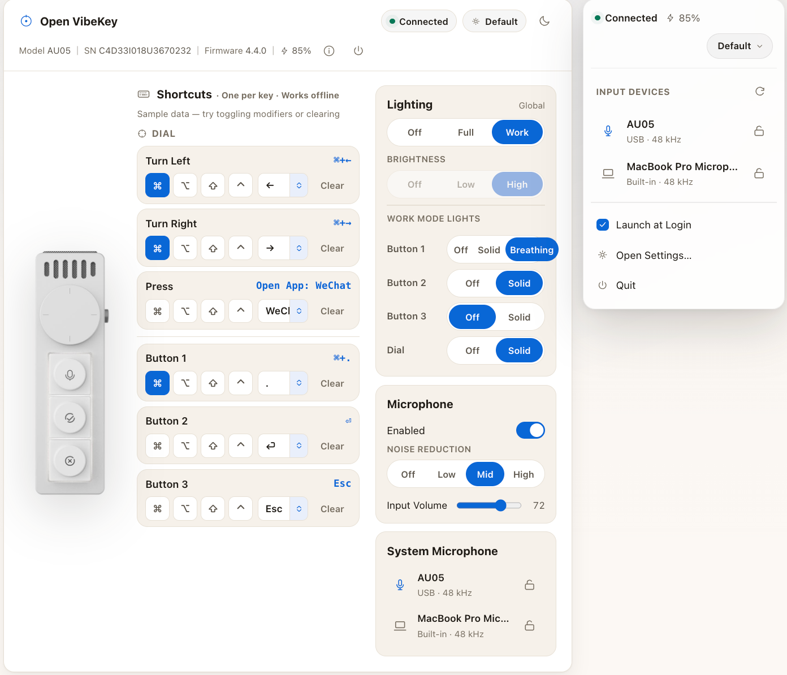

# Open VibeKey

<p>
  <a href="https://github.com/palaemonboy/OpenVibeKey/stargazers"></a>
  <a href="https://github.com/palaemonboy/OpenVibeKey/releases/latest"></a>
  <a href="https://openvibekey.palaemon.dev"></a>
  <a href="#license"></a>
  <a href="README.zh-CN.md"></a>
</p>

**English** | [简体中文](README.zh-CN.md)

Make your VibeKey work your way on macOS.

Open VibeKey is a free, open-source macOS app for VibeKey / Kehwin Dial Mini (AU05). Customize the dial and buttons, adjust lighting and microphone settings, and choose your Mac’s audio input—all from a settings window and a menu bar panel.



*Interface preview with sample settings.*

## Requirements

- macOS 13 or later.
- A VibeKey / Kehwin Dial Mini (AU05) and its receiver for device controls.

## Installation

Install with Homebrew:

```sh
brew install --cask palaemonboy/tap/openvibekey
```

## How to use

1. Connect the receiver to your Mac and turn on your VibeKey.
2. Open Open VibeKey, then click its icon in the menu bar.
3. Choose **Open Settings…** to customize the dial, buttons, lighting, and microphone.
4. In the menu bar panel, select an input device. Click its lock icon to keep it selected as your Mac’s audio input.
5. Enable **Launch at Login** if you want Open VibeKey available whenever you sign in.

Open VibeKey stays in the menu bar, so it does not appear in the Dock.

## Features

- **Custom shortcuts:** Assign keyboard shortcuts or media actions to the buttons, dial turns, and dial press.
- **Open apps:** Use a button or the dial press to launch or switch to a chosen app.
- **Profiles:** Save different setups and switch between them from the menu bar.
- **Lighting controls:** Adjust global lighting, brightness, and individual lights in Work mode.
- **Microphone controls:** Toggle the device microphone, choose a noise-reduction level, and adjust input volume.
- **Audio input selection:** Switch between your VibeKey microphone, your Mac’s built-in microphone, and other available inputs. Lock your preferred input to prevent unwanted switching.
- **Device status:** Check connection status, battery level, and firmware information.
- **Launch at login:** Keep your controls close at hand after signing in.

## Good to know

- Ordinary keyboard shortcuts saved to the device continue to work after you quit Open VibeKey. **Open App** actions require Open VibeKey to remain running.
- Open App bindings can conflict with shortcuts used by other software. If an action does not respond, check for shortcut conflicts.
- macOS may ask for microphone access when you use the live input level meter.
- Device controls require the AU05 to be powered on; connecting the receiver alone is not enough.

## Project Structure

```text
.
├── native/VibeKit/       # Native macOS app
│   ├── Package.swift     # Project configuration
│   └── Sources/         # App interface, device controls, resources, and tests
├── assets/screenshots/  # English and Chinese interface previews
├── landing/             # Project website
├── scripts/             # App packaging and localization checks
├── README.md            # English introduction
├── README.zh-CN.md       # Chinese introduction
└── LICENSE              # MIT license
```

## Feedback

Found a problem or have a suggestion? [Open an issue](https://github.com/palaemonboy/OpenVibeKey/issues) and include your macOS version, device firmware version, and what happened.

## License

[MIT](LICENSE) © 2026 palaemonboy.

If you build on this project, a link back to [Open VibeKey](https://github.com/palaemonboy/OpenVibeKey) is appreciated. This is a voluntary request, not an additional license condition.
