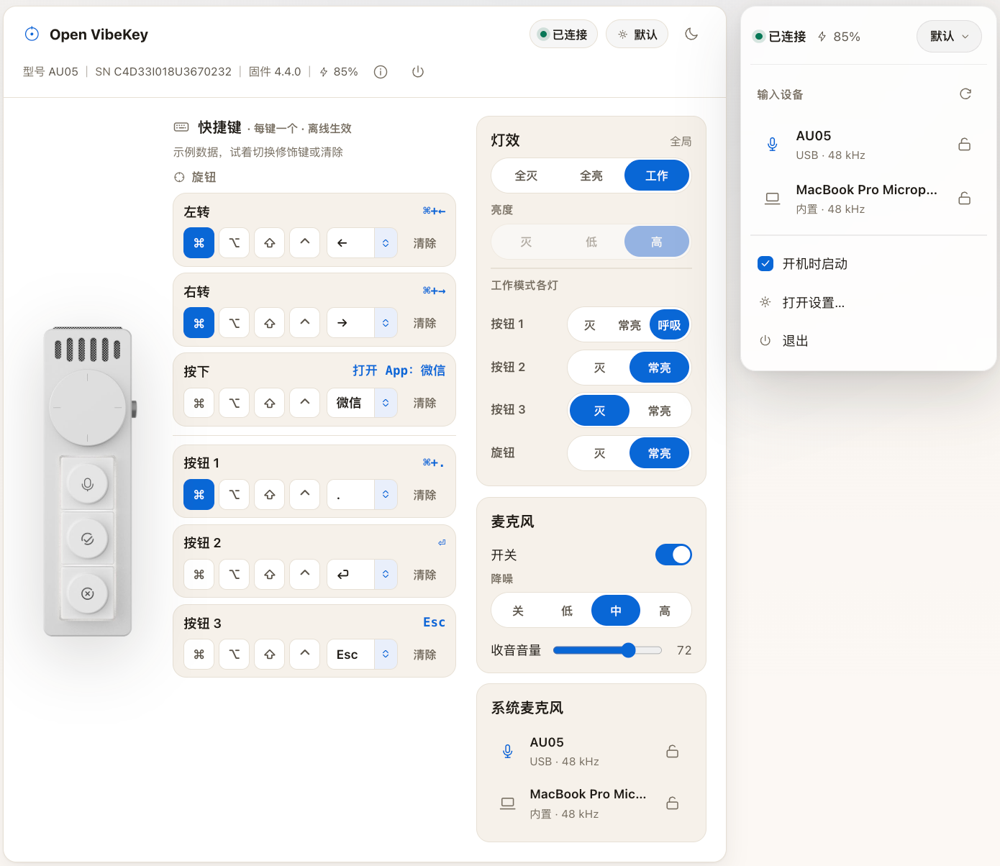

# Open VibeKey

[English](README.md) | **简体中文**

让 VibeKey 更适合你的 Mac 使用习惯。

Open VibeKey 是一款免费、开源的 macOS 应用，适用于 VibeKey / Kehwin Dial Mini（AU05）。通过设置窗口和菜单栏面板，自定义旋钮与按键、调整灯光和麦克风设置，并选择 Mac 的音频输入设备。



*界面预览，展示内容为示例配置。*

## 使用要求

- macOS 13 或更新版本。
- 使用设备控制功能需要 VibeKey / Kehwin Dial Mini（AU05）及其接收器。

## 安装

使用 Homebrew 安装：

```sh
brew install --cask palaemonboy/tap/openvibekey
```

## 如何使用

1. 将接收器连接到 Mac，并打开 VibeKey 的电源。
2. 打开 Open VibeKey，点击菜单栏中的应用图标。
3. 选择「打开设置…」，配置旋钮、按键、灯光和麦克风。
4. 在菜单栏面板中选择输入设备；点击旁边的锁图标，将其锁定为 Mac 的音频输入设备。
5. 如果希望每次登录后都能使用，勾选「开机时启动」。

Open VibeKey 常驻菜单栏，不会显示在 Dock 中。

## 功能

- **自定义快捷键：** 为按钮、旋钮左右转动和旋钮按下分配键盘快捷键或媒体操作。
- **打开应用：** 通过按钮或旋钮按下，启动或切换到指定 App。
- **配置切换：** 保存不同使用场景的配置，并从菜单栏快速切换。
- **灯光控制：** 调整全局灯光、亮度，以及工作模式下各个灯的状态。
- **麦克风控制：** 开关设备麦克风、选择降噪等级和调整收音音量。
- **音频输入选择：** 在 VibeKey 麦克风、Mac 内置麦克风及其他可用输入设备之间切换；锁定常用输入设备，避免被意外切换。
- **设备状态：** 查看连接状态、电量和固件信息。
- **开机启动：** 登录 Mac 后即可使用菜单栏控制。

## 使用提示

- 保存到设备的普通键盘快捷键，在退出 Open VibeKey 后仍可使用。「打开 App」功能需要 Open VibeKey 保持运行。
- 「打开 App」的按键绑定可能与其他软件的快捷键冲突。如果没有响应，请检查是否存在快捷键冲突。
- 使用实时输入电平功能时，macOS 可能会请求麦克风权限。
- 控制设备前需要打开 AU05 的电源，仅插入接收器还不够。

## 项目结构

```text
.
├── native/VibeKit/       # 原生 macOS 应用
│   ├── Package.swift     # 项目配置
│   └── Sources/         # 应用界面、设备控制、资源和测试
├── assets/screenshots/  # 中英文界面预览图
├── landing/             # 项目官网
├── scripts/             # App 打包与本地化检查
├── README.md            # 英文介绍
├── README.zh-CN.md       # 中文介绍
└── LICENSE              # MIT 许可证
```

## 问题反馈

遇到问题或有功能建议？欢迎[提交 Issue](https://github.com/palaemonboy/OpenVibeKey/issues)，并附上 macOS 版本、设备固件版本和问题描述。

## 许可证

[MIT](LICENSE) © 2026 palaemonboy。

如果你基于本项目进行二次开发，欢迎注明来源并链接到 [Open VibeKey](https://github.com/palaemonboy/OpenVibeKey)。这是自愿的署名倡议，不是许可证的额外限制。
